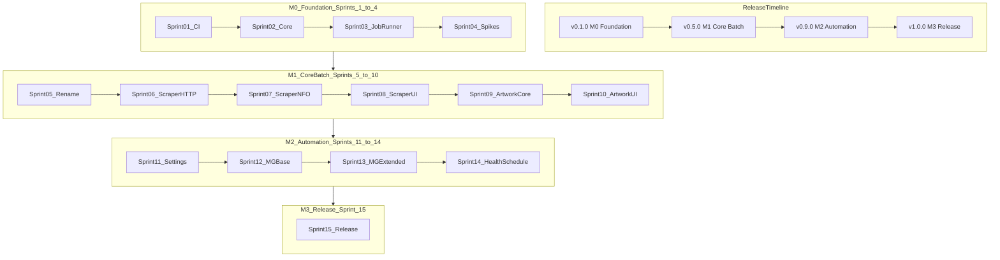

# Product Roadmap — Plex NFO Creator (Native macOS App)

**Method:** 15 two-week SCRUM sprints · 20 story points max per sprint · **30 weeks** total  
**Repository:** [`Native macOS App/`](../../)  
**Planning index:** [Project Plans README](../README.md)

## Executive timeline

| Phase | Milestone | Sprints | Weeks | App version | Deliverable |
|-------|-----------|---------|-------|-------------|-------------|
| Foundation | M0 | 1–4 | 8 | 0.1.0 | Xcode, CI, Core services, spikes, fixtures |
| Core batch | M1 | 5–10 | 12 | 0.5.0 | Rename, Scraper, Artwork tabs |
| Automation | M2 | 11–14 | 8 | 0.9.0 | Settings, Metadata Generator, Health Check, scheduling |
| Release | M3 | 15 | 2 | 1.0.0 | QA, signed artifact, git tag |

## Milestone exit criteria

### M0 — Foundation (v0.1.0)

- `swift build` + `swift test` green on `macos-latest` CI
- `VERSION` = `0.1.0`; `BundleDataManifest.json` present
- JobRunner, ProgressSheet, Keychain, ConfigStore, LoggingService implemented
- NFO/ffmpeg spikes complete; `export_nfo_fixtures.py` produces goldens
- Doc: [M0-Foundation.md](Milestones/M0-Foundation.md)

### M1 — Core batch tools (v0.5.0)

- **Rename**, **Scraper**, and **Artwork** tabs demo-ready from UI
- Scraper + artwork NFO/poster parity tests pass
- Bundled ffmpeg in app resources
- Doc: [M1-Core-Batch-Tools.md](Milestones/M1-Core-Batch-Tools.md)

### M2 — Automation suite (v0.9.0)

- **Settings** + first-launch wizard for all configs/secrets
- **Metadata Generator** tab (TV/movies + music toggle)
- **Health Check** tab + in-app scheduling (replaces `install-macos.sh`)
- Doc: [M2-Automation-Suite.md](Milestones/M2-Automation-Suite.md)

### M3 — Release (v1.0.0)

- All five tabs + scheduling production-ready
- `VERSION` = `1.0.0`; dated CHANGELOG; git tag; release workflow artifact
- Doc: [M3-Release-1-0-0.md](Milestones/M3-Release-1-0-0.md)

## Architecture diagram

Source: [ROADMAP.mmd](ROADMAP.mmd)

## Sprint calendar (TBD at kickoff)

| Sprint | Milestone | Plan document |
|--------|-----------|---------------|
| 01 | M0 | [Sprint 01](../Sprint%20Plans/Sprint-01-repo-ci-foundation.md) |
| 02 | M0 | [Sprint 02](../Sprint%20Plans/Sprint-02-core-services-bootstrap.md) |
| 03 | M0 | [Sprint 03](../Sprint%20Plans/Sprint-03-job-runner-secrets.md) |
| 04 | M0 | [Sprint 04](../Sprint%20Plans/Sprint-04-spikes-fixtures.md) |
| 05 | M1 | [Sprint 05](../Sprint%20Plans/Sprint-05-rename-module.md) |
| 06 | M1 | [Sprint 06](../Sprint%20Plans/Sprint-06-scraper-http-layer.md) |
| 07 | M1 | [Sprint 07](../Sprint%20Plans/Sprint-07-scraper-nfo-generation.md) |
| 08 | M1 | [Sprint 08](../Sprint%20Plans/Sprint-08-scraper-tab-complete.md) |
| 09 | M1 | [Sprint 09](../Sprint%20Plans/Sprint-09-artwork-extraction-core.md) |
| 10 | M1 | [Sprint 10](../Sprint%20Plans/Sprint-10-artwork-tab-complete.md) |
| 11 | M2 | [Sprint 11](../Sprint%20Plans/Sprint-11-settings-first-launch.md) |
| 12 | M2 | [Sprint 12](../Sprint%20Plans/Sprint-12-metadata-generator-base.md) |
| 13 | M2 | [Sprint 13](../Sprint%20Plans/Sprint-13-metadata-generator-extended.md) |
| 14 | M2 | [Sprint 14](../Sprint%20Plans/Sprint-14-health-check-scheduling.md) |
| 15 | M3 | [Sprint 15](../Sprint%20Plans/Sprint-15-release-1-0-0.md) |

## External tracking

- [GitHub Project 2 — Kanban](https://github.com/users/roto31/projects/2/views/7)
- [GitHub Project 2 — Roadmap](https://github.com/users/roto31/projects/2/views/4)
