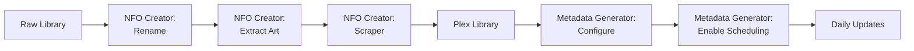
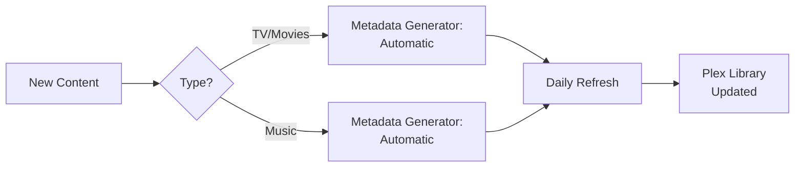
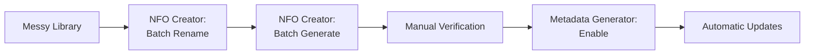

# Integration: Plex NFO Creator & Poster Art Extractor

## Overview

The **Plex NFO Creator & Poster Art Extractor** toolkit is now integrated as a complementary tool within the Metadata Generator ecosystem. This document explains how to use both systems together.

---

## What is Plex NFO Creator?

A suite of Python scripts that:

- **Generate NFO metadata files** from TMDB/TVDB APIs
- **Extract embedded poster artwork** from MP4/M4V files
- **Clean folder/file names** before scraping
- **Resume safely** with progress tracking
- **Cross-platform** (macOS, Linux, Windows)

**Repository:** https://github.com/roto31/Plex-NFO-creator-and-Poster-Art-creator

**Best for:**
- Existing local libraries with embedded metadata
- Batch cleanup and renaming
- Direct API scraping without Plex integration
- Extracting artwork from video files

---

## How It Complements the Metadata Generator

### Metadata Generator (plex_metadata_generator_extended.py)

**Purpose:** Automated, scheduled metadata generation  
**Scope:** TV shows + Music  
**Updates:** Daily (scheduled)  
**Integration:** Direct Plex library refresh  
**APIs:** TVDb, TMDb, Spotify, MusicBrainz  

### Plex NFO Creator (scraper.py)

**Purpose:** One-time bulk metadata generation  
**Scope:** Movies + TV shows  
**Updates:** Manual/batch  
**Integration:** Filesystem only (creates NFO files)  
**APIs:** TVDb, TMDb  

---

## When to Use Each

### Use Metadata Generator When:

✅ You want **automatic daily updates**  
✅ You have **music library** to manage  
✅ You want **scheduled, hands-off** operation  
✅ You need **Plex API integration**  
✅ You want **single unified system** for everything  

### Use Plex NFO Creator When:

✅ You need **one-time bulk processing**  
✅ You want **direct TMDB/TVDB scraping**  
✅ You need to **extract embedded artwork** from videos  
✅ You want to **rename/clean** filenames first  
✅ You prefer **no Plex API dependency**  

### Use Both Together When:

✅ Initial setup: Use NFO Creator for bulk processing  
✅ Ongoing: Use Metadata Generator for automation  
✅ Cleanup: Use NFO Creator's rename tool  
✅ Artwork: Use NFO Creator to extract embedded art  
✅ Scheduling: NFO Creator for batch jobs, Generator for daily sync  

---

## Integration Workflow

### Scenario 1: New Library Setup

```
1. Use NFO Creator:
   ├─ Rename files (rename_movies.py)
   ├─ Extract embedded artwork (extract_artwork.py)
   └─ Generate NFO files (scraper.py)

2. Verify in Plex:
   └─ Library → Settings → Agents → Local Media Assets (top)

3. Deploy Metadata Generator:
   ├─ For ongoing daily updates
   ├─ For music library management
   └─ For mixed TV/movie/music scenarios
```

### Scenario 2: Existing Plex Library

```
1. Use Metadata Generator:
   ├─ Initial setup (30-40 min)
   ├─ Configuration (TV + Music)
   └─ Enable scheduling

2. Optionally use NFO Creator:
   ├─ For bulk artwork extraction
   ├─ For filename cleanup
   └─ For additional manual processing
```

### Scenario 3: Batch Operations

```
1. Use NFO Creator:
   ├─ Rename_movies.py for batch filename cleanup
   ├─ Scraper.py for bulk metadata generation
   └─ Extract_artwork.py for artwork extraction

2. Use Metadata Generator:
   ├─ For ongoing maintenance
   └─ For music and new content
```

---

## Installation & Setup

### Plex NFO Creator

```bash
# Clone the repository
git clone https://github.com/roto31/Plex-NFO-creator-and-Poster-Art-creator.git
cd Plex-NFO-creator-and-Poster-Art-creator

# Add API keys (lines 25-26 in scraper.py)
# TMDB_API_KEY = "your_key"
# TVDB_API_KEY = "your_key"

# Run scripts
python3 scraper.py movies "/path/to/movies"
python3 scraper.py tvshows "/path/to/tv"
python3 extract_artwork.py "/path/to/videos"
```

### Metadata Generator

```bash
# Use extended script (supports both TV + Music)
pip install requests
cp plex_metadata_generator_extended.py /usr/local/bin/
cp plex-metadata-generator-extended.conf /etc/

# Configure with API keys
sudo nano /etc/plex-metadata-generator.conf

# Enable scheduling
sudo systemctl enable plex-metadata-generator.timer
```

---

## Scripts Comparison

| Feature | scraper.py | extract_artwork.py | Metadata Generator |
|---------|-----------|-------------------|-------------------|
| **API Integration** | TMDB, TVDB | FFmpeg extraction | TMDB, TVDB, Spotify, MusicBrainz |
| **Output** | NFO files | JPEG images | NFO + JPEG + auto-refresh |
| **Scheduling** | Manual | Manual | Automatic daily |
| **Music Support** | ❌ | ❌ | ✅ |
| **Plex Integration** | Direct files | Direct files | API integration |
| **Resume/Progress** | ✅ Yes | ✅ Yes | ✅ Yes |
| **Cross-platform** | ✅ Yes | ✅ Yes | Linux/macOS |
| **One-time or Loop** | One-time | One-time | Loop (scheduled) |

---

## Combined Workflow Examples

### Example 1: Initial Library Build



### Example 2: Ongoing Maintenance



### Example 3: Batch Cleanup + Scheduling



---

## File Locations After Both Systems

```
/mnt/media/
├── Movies/
│   ├── Movie Title (2020)/
│   │   ├── Movie Title (2020).mkv
│   │   ├── movie.nfo              ← NFO Creator/Generator
│   │   └── poster.jpg             ← NFO Creator/Generator
│   └── ...
├── TV/
│   ├── Show Name/
│   │   ├── tvshow.nfo             ← NFO Creator/Generator
│   │   ├── poster.jpg             ← NFO Creator/Generator
│   │   ├── Season 1/
│   │   │   ├── episode.mkv
│   │   │   ├── season.nfo         ← NFO Creator/Generator
│   │   │   └── episode.nfo        ← NFO Creator/Generator
│   │   └── ...
│   └── ...
└── Music/
    ├── Artist Name/
    │   ├── artist.nfo             ← Generator only
    │   ├── artist.jpg             ← Generator only
    │   ├── Album Name/
    │   │   ├── album.nfo          ← Generator only
    │   │   ├── folder.jpg         ← Generator only
    │   │   └── track.nfo          ← Generator only
    │   └── ...
    └── ...
```

---

## Configuration for Both Systems

### Metadata Generator Config

```json
{
  "tv_library_root": "/mnt/media/TV",
  "music_library_root": "/mnt/media/Music",
  "plex": {
    "url": "http://localhost:32400",
    "token": "YOUR_TOKEN",
    "tv_library_key": "1",
    "music_library_key": "2"
  },
  "tvdb": { "api_key": "YOUR_KEY" },
  "tmdb": { "api_key": "YOUR_KEY" },
  "spotify": { "client_id": "...", "client_secret": "..." }
}
```

### NFO Creator (scraper.py lines 25-26)

```python
TMDB_API_KEY = "your_tmdb_key"
TVDB_API_KEY = "your_tvdb_key"
```

---

## Using NFO Creator with Metadata Generator

### Step 1: Initial Setup with NFO Creator

```bash
# Clean filenames (dry run)
python3 rename_movies.py "/mnt/media/Movies"

# Apply cleanup
python3 rename_movies.py "/mnt/media/Movies" --rename

# Generate NFO files
python3 scraper.py movies "/mnt/media/Movies"
python3 scraper.py tvshows "/mnt/media/TV"

# Extract artwork
python3 extract_artwork.py "/mnt/media"
```

### Step 2: Configure Metadata Generator

```bash
sudo nano /etc/plex-metadata-generator.conf
# Add TV and music libraries, API keys
```

### Step 3: Enable Metadata Generator

```bash
# Systemd timer (recommended)
sudo systemctl enable plex-metadata-generator.timer
sudo systemctl start plex-metadata-generator.timer

# Or cron
0 2 * * * plex-metadata-generator --media-type tv
0 4 * * * plex-metadata-generator --media-type music
```

### Step 4: Plex Configuration

```
Settings → Libraries → Movies/TV
→ Agents → Move "Local Media Assets" to top
→ Save
```

---

## Troubleshooting Integration

### NFO Creator doesn't find TMDB/TVDB matches

→ Use Metadata Generator instead (has better fallback chain)  
→ Check API keys in scraper.py  
→ Verify filename format (Title Year)

### NFO files created but Plex doesn't show metadata

→ Verify "Local Media Assets" agent is prioritized  
→ Manually refresh library in Plex
→ Check file permissions (must be readable by Plex user)

### Metadata Generator overwrites NFO Creator files

→ Both systems create same format → No conflict  
→ Metadata Generator uses intelligent fallback  
→ Later run overwrites with fresh data (expected)

### Artwork not showing

→ NFO Creator: Verify extract_artwork.py ran successfully  
→ Generator: Check Spotify/API image URLs  
→ Plex: Manual refresh of library

---

## Best Practices

### For Initial Setup

1. Use NFO Creator for bulk processing
2. Run rename_movies.py first
3. Then scraper.py for metadata
4. Then extract_artwork.py for artwork
5. Verify in Plex
6. Deploy Metadata Generator for ongoing updates

### For Ongoing Maintenance

1. Let Metadata Generator run daily
2. Use NFO Creator for one-time batch jobs
3. Keep API keys updated in both systems
4. Monitor logs: `/var/log/plex-metadata-generator.log`

### For Music

1. Metadata Generator is **required** (NFO Creator doesn't support music)
2. Use Spotify for best results
3. MusicBrainz as fallback

### For Movies

1. Either system works
2. NFO Creator better for batch operations
3. Generator better for ongoing updates
4. Combine for best coverage

---

## Support

### Plex NFO Creator Issues

→ Visit: https://github.com/roto31/Plex-NFO-creator-and-Poster-Art-creator  
→ Issues: https://github.com/roto31/Plex-NFO-creator-and-Poster-Art-creator/issues  
→ Wiki: https://github.com/roto31/Plex-NFO-creator-and-Poster-Art-creator/wiki  

### Metadata Generator Issues

→ Run: `python3 health-check.py`  
→ Check: `/var/log/plex-metadata-generator.log`  
→ See: Documentation files in this package

---

## Version Compatibility

| Component | Version | Status |
|-----------|---------|--------|
| Plex NFO Creator | Latest | Fully compatible |
| Metadata Generator | v1.1 | Designed for integration |
| Plex Media Server | Any recent | No version dependency |
| Python | 3.8+ | Required for both |

---

## Next Steps

1. **For existing Plex library:** Start with Metadata Generator
2. **For new setup:** Use NFO Creator first, then Generator
3. **For music:** Must use Metadata Generator (only system supporting music)
4. **For batch jobs:** Use NFO Creator for one-time operations
5. **For automation:** Use Metadata Generator for daily scheduling

---

**Last Updated:** June 2026  
**Integration Status:** Complete  
**Compatibility:** Full  
**Recommended:** Use both systems together for maximum coverage
