# Plex Metadata System - Workflow & Signal Diagrams

## 1. System Architecture Overview

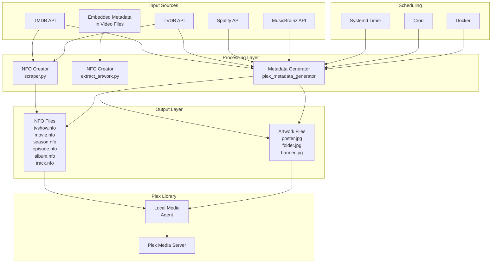

---

## 2. NFO Creator Workflow

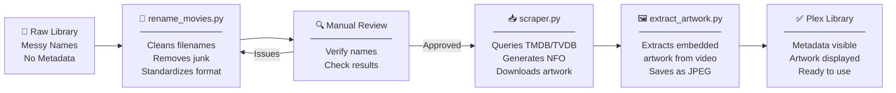

---

## 3. Metadata Generator Workflow

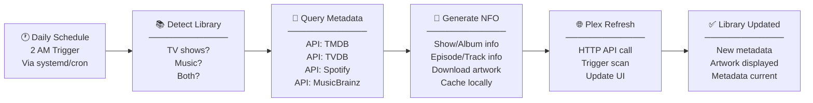

---

## 4. Integrated Workflow (Both Systems)

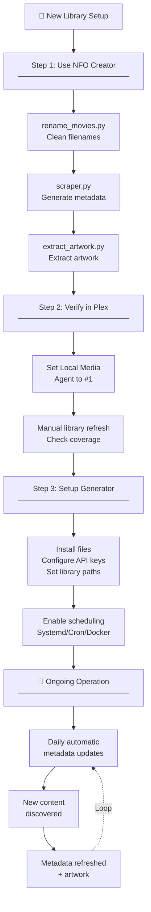

---

## 5. Signal Flow: Metadata Generator

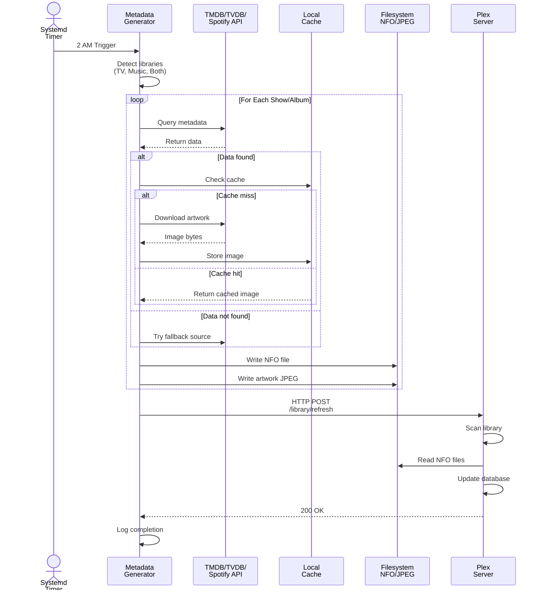

---

## 6. Signal Flow: NFO Creator

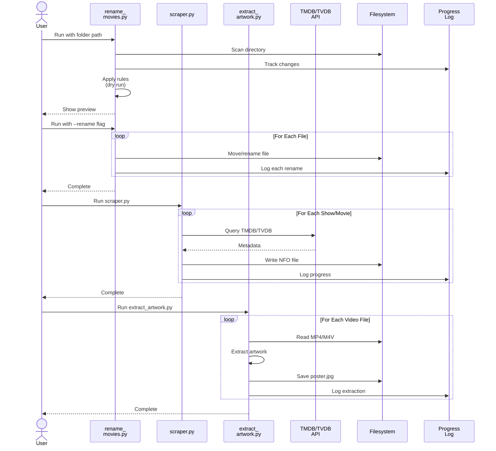

---

## 7. Data Flow: TV Show Processing

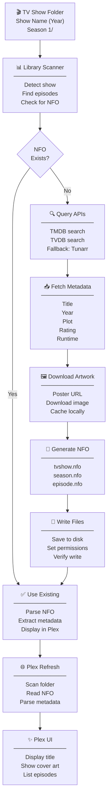

---

## 8. Data Flow: Music Album Processing

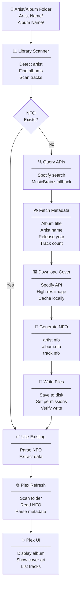

---

## 9. Scheduling Architecture

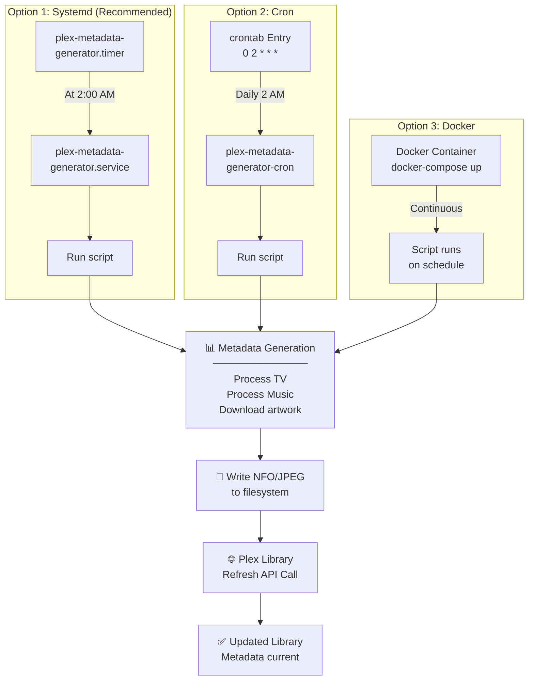

---

## 10. Error Handling & Fallback Chain

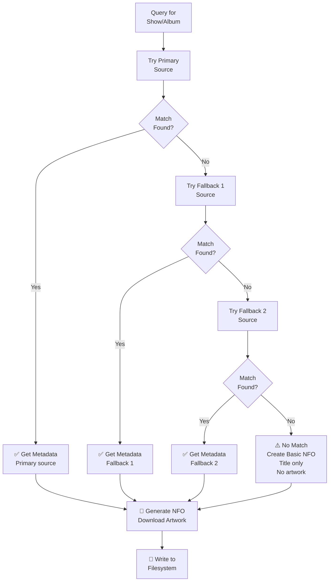

---

## 11. Library Structure Hierarchy

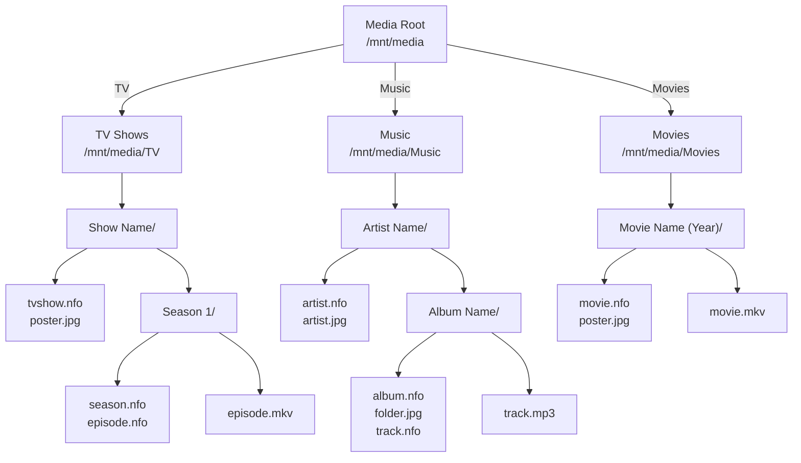

---

## 12. API Priority Chain: Metadata Generator

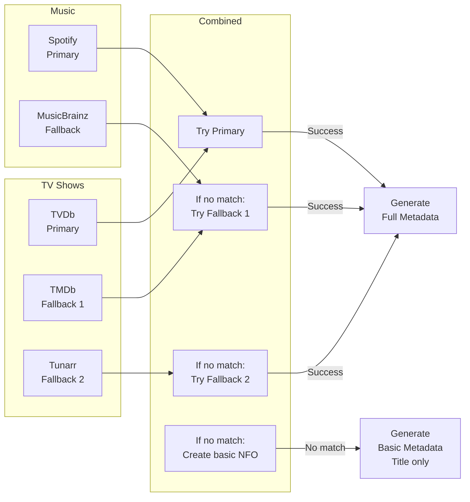

---

## 13. Comparison Matrix

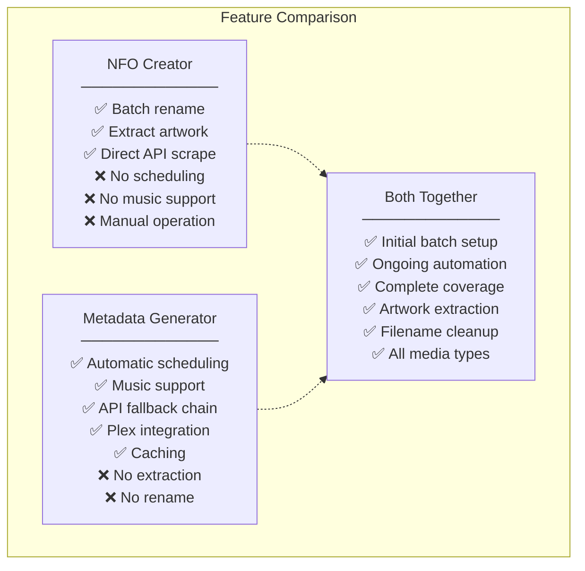

---

**These diagrams provide complete visibility into:**
- System architecture and data flow
- Workflow sequences for both systems
- Signal flows between components
- Scheduling mechanisms
- Error handling and fallback chains
- Library organization
- Integration scenarios
