# Process & Decision Flow Diagrams

All diagrams are written in [Mermaid](https://mermaid.js.org/) and render natively on GitHub.

---

## 1. Overall Pipeline — End to End

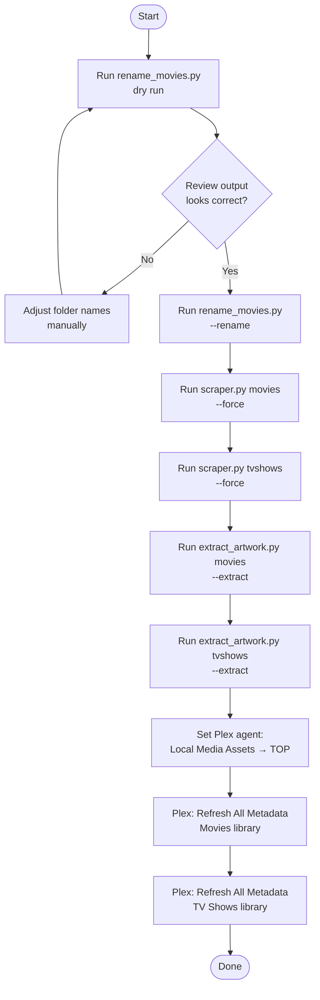

---

## 2. preflight.py — Startup Check Sequence

Every script runs these checks before opening the progress window.

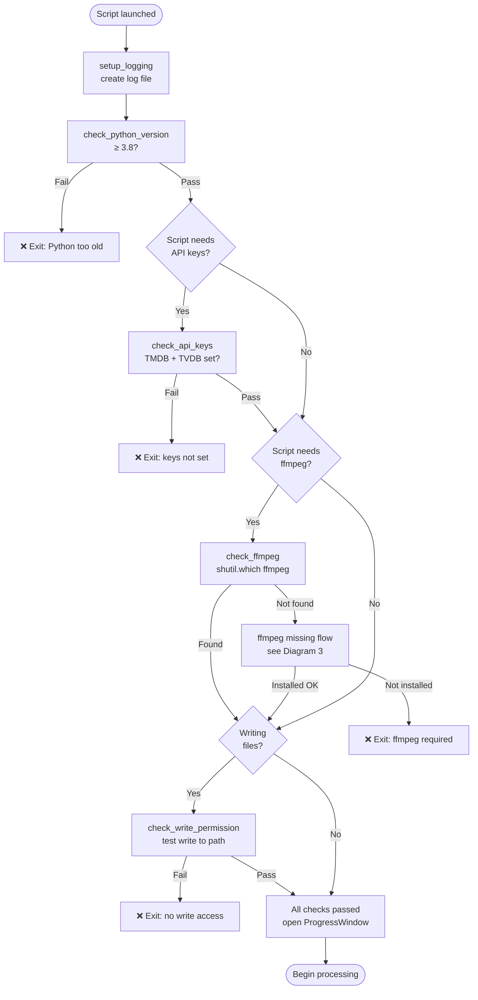

---

## 3. preflight.py — ffmpeg Missing: Install Decision Flow

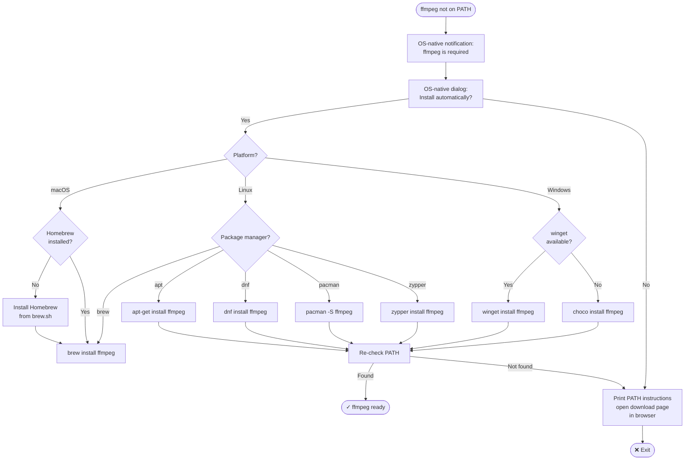

---

## 4. preflight.py — Progress Window Threading Model

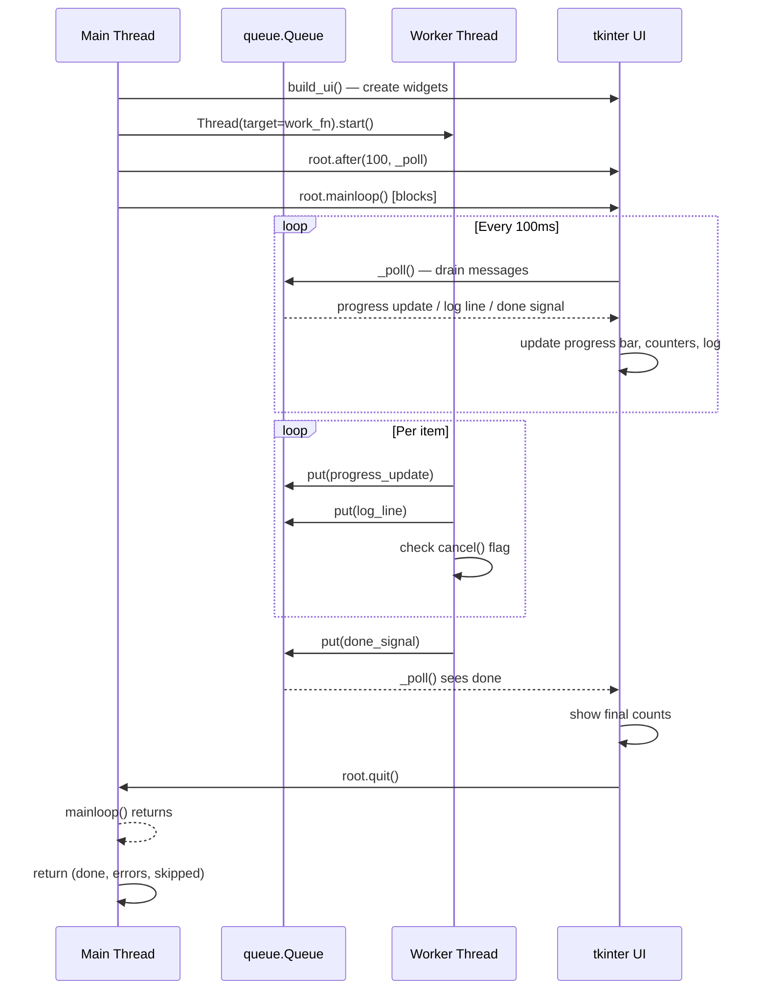

---

## 5. preflight.py — Log File Lifecycle

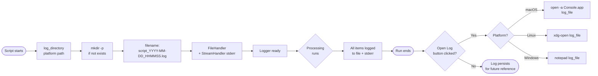

---

## 6. scraper.py — Top-Level Flow (v1.2)

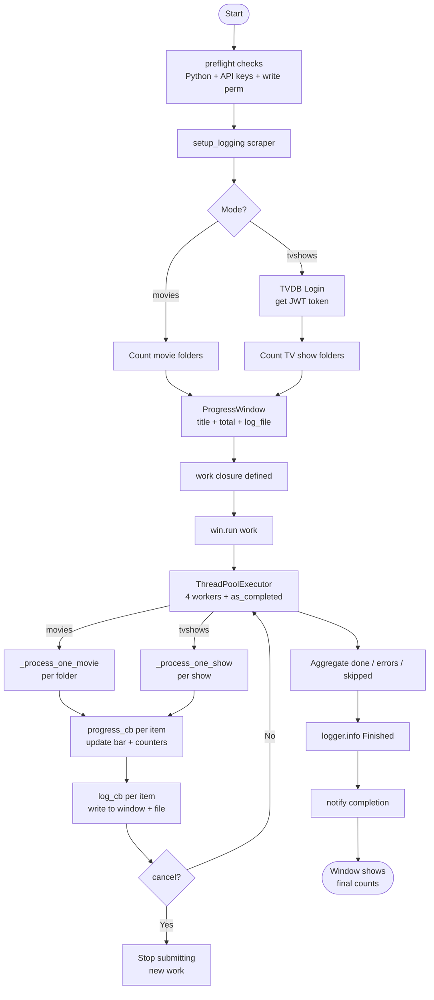

---

## 7. scraper.py — Movie Processing (per folder)

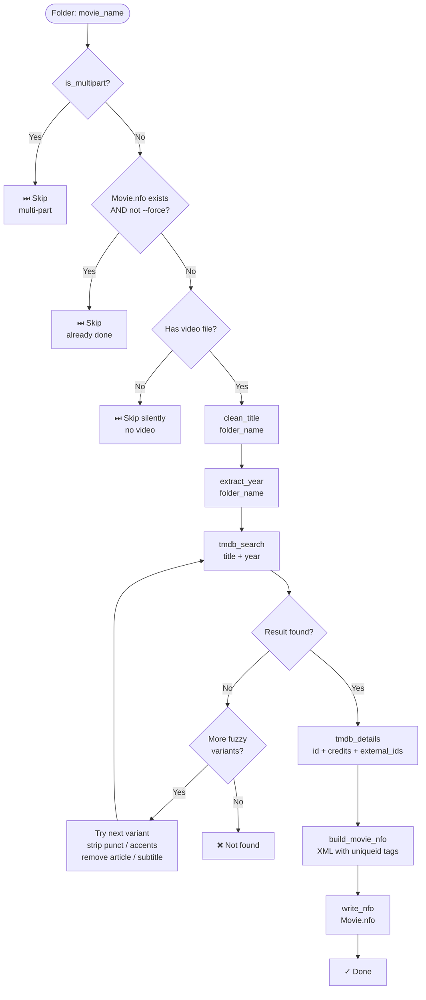

---

## 8. scraper.py — TV Show Processing (per show)

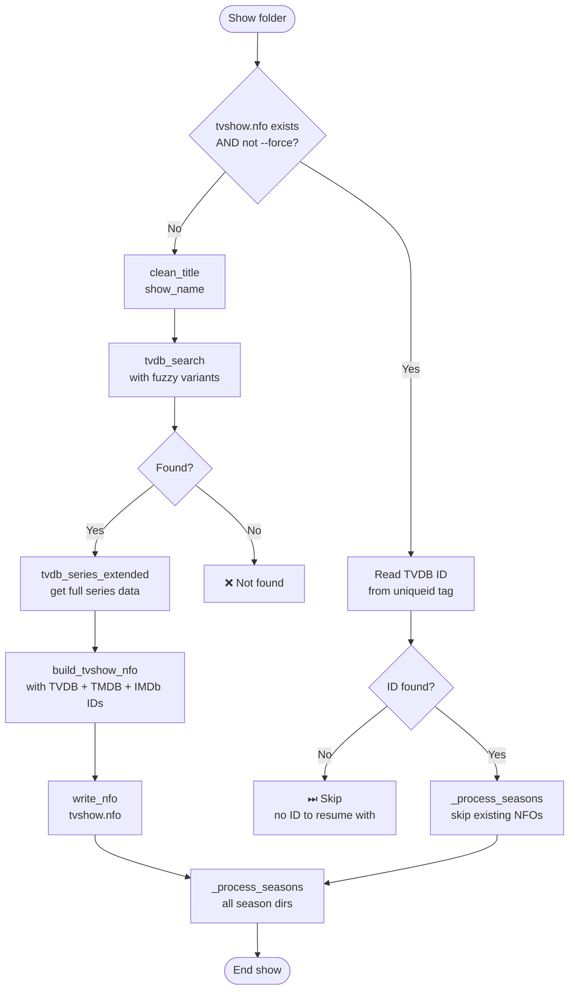

---

## 9. scraper.py — Season & Episode Processing

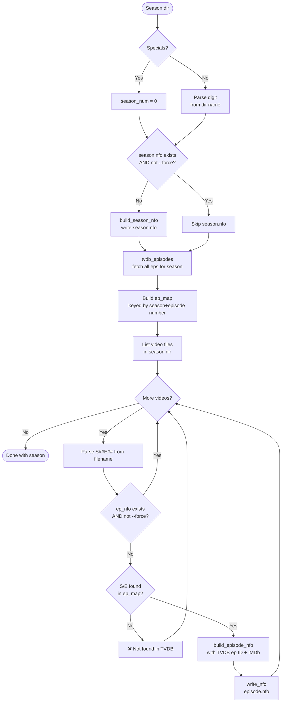

---

## 10. scraper.py — Fuzzy Title Matching

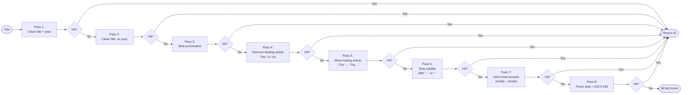

---

## 11. extract_artwork.py — Startup Flow (v1.2)

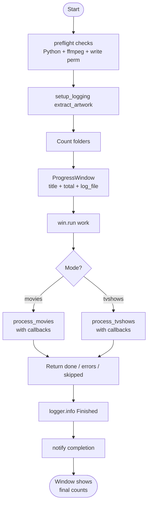

---

## 12. extract_artwork.py — Movie Mode Flow

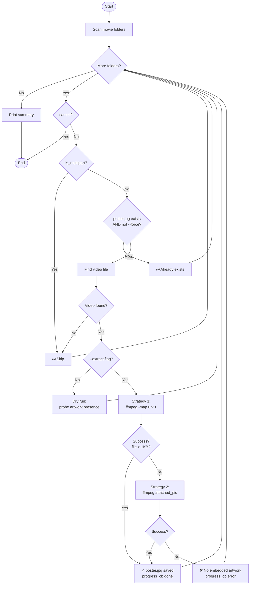

---

## 13. extract_artwork.py — TV Show Mode Flow

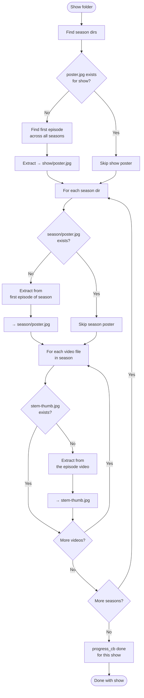

---

## 14. rename_movies.py — Startup Flow (v1.2)

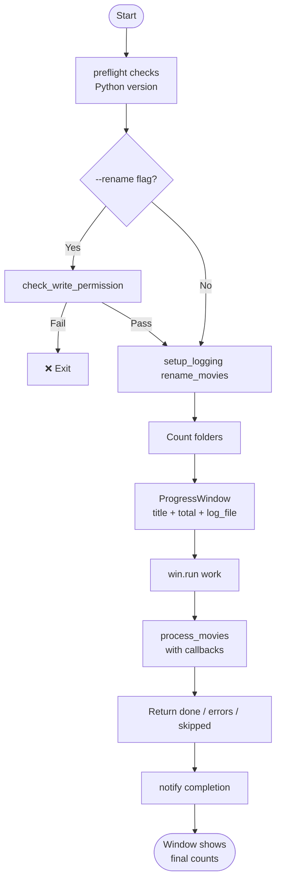

---

## 15. rename_movies.py — Decision Flow

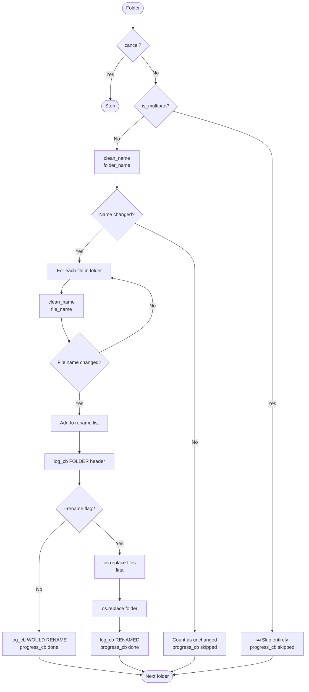

---

## 16. clean_title() — Transformation Pipeline

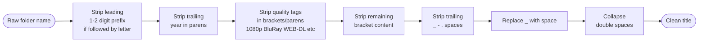

---

## 17. Plex Configuration After Running Scripts

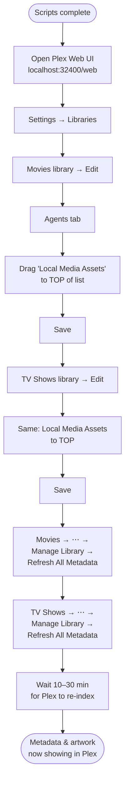
