# Process & Decision Flow Diagrams

All diagrams are written in [Mermaid](https://mermaid.js.org/) and render natively on GitHub.

---

## 1. Overall Pipeline — End to End


---

## 2. preflight.py — Startup Check Sequence

Every script runs these checks before opening the progress window.

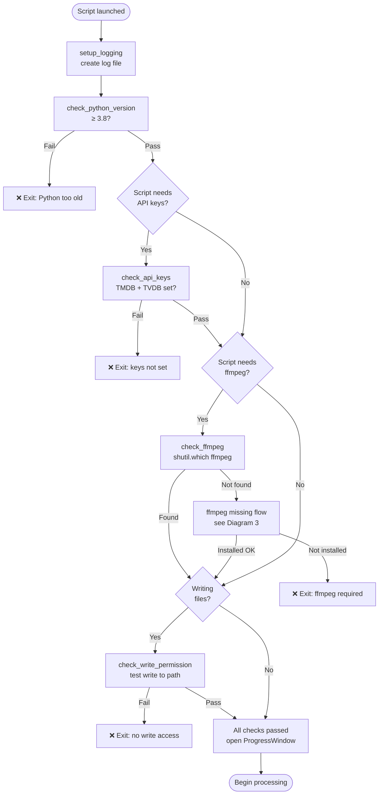

---

## 3. preflight.py — ffmpeg Missing: Install Decision Flow

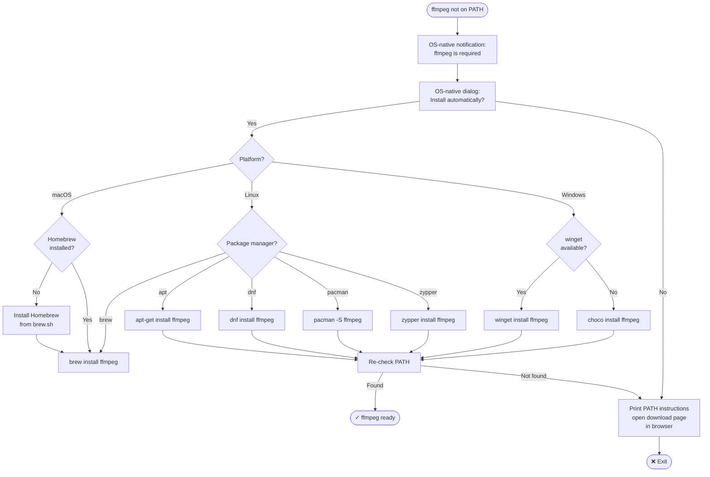

---

## 4. preflight.py — Progress Window Threading Model

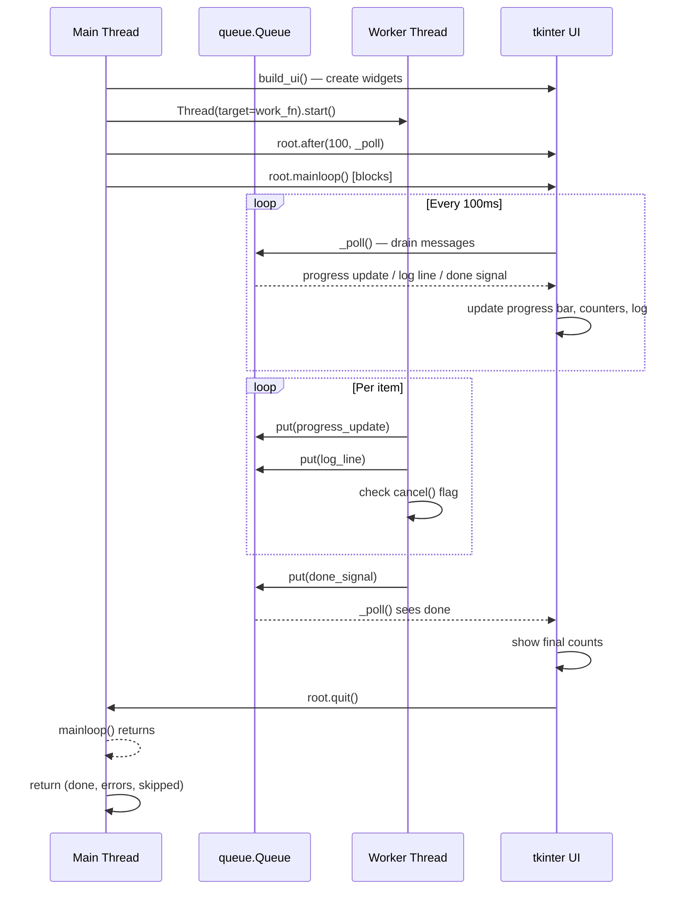

---

## 5. preflight.py — Log File Lifecycle

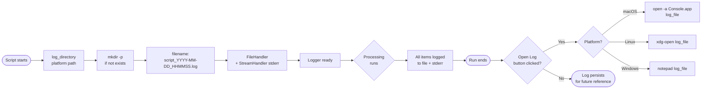

---

## 6. scraper.py — Top-Level Flow (v1.2)

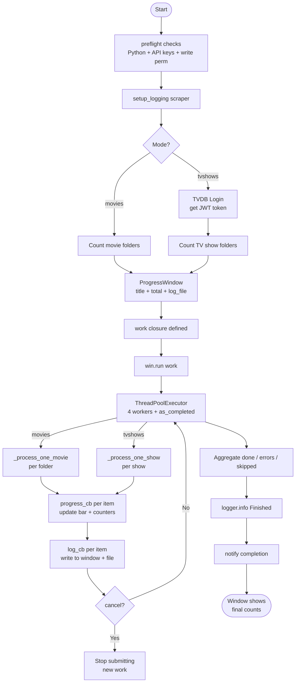

---

## 7. scraper.py — Movie Processing (per folder)


---

## 8. scraper.py — TV Show Processing (per show)


---

## 9. scraper.py — Season & Episode Processing


---

## 10. scraper.py — Fuzzy Title Matching

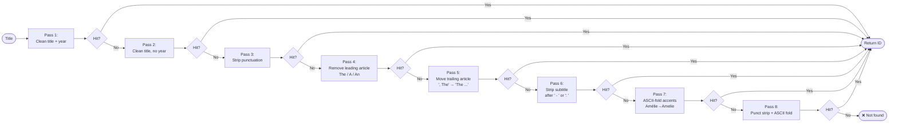

---

## 11. extract_artwork.py — Startup Flow (v1.2)

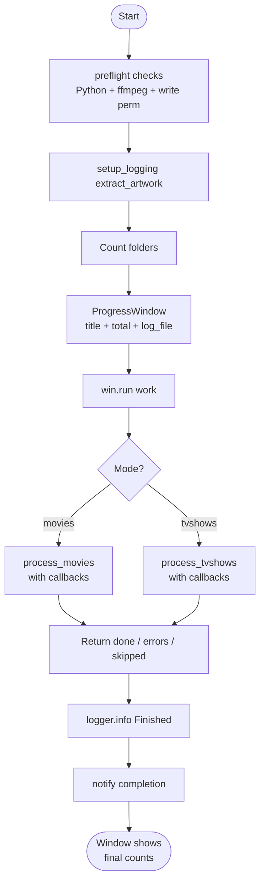

---

## 12. extract_artwork.py — Movie Mode Flow

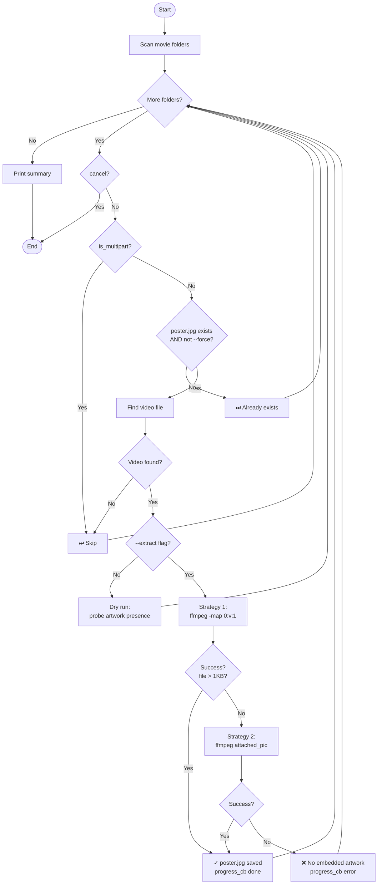

---

## 13. extract_artwork.py — TV Show Mode Flow

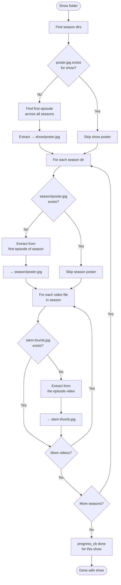

---

## 14. rename_movies.py — Startup Flow (v1.2)

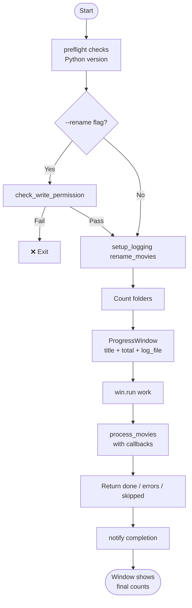

---

## 15. rename_movies.py — Decision Flow

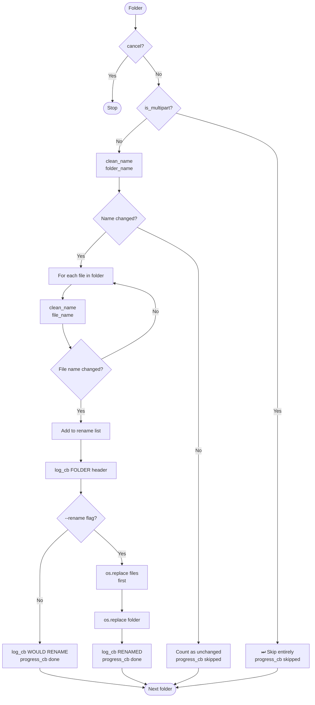

---

## 16. clean_title() — Transformation Pipeline


---

## 17. Plex Configuration After Running Scripts

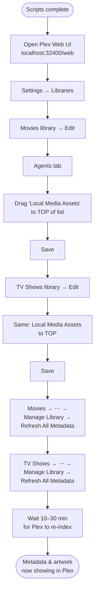

---

## Diagram 18 — Metadata Generator: System Architecture

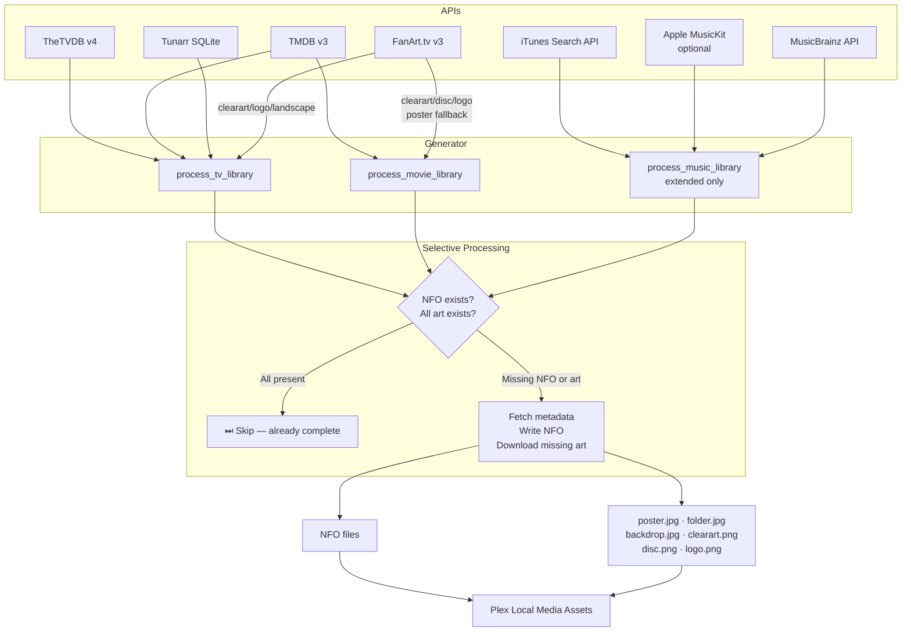

---

## Diagram 19 — Metadata Generator: Movie Processing Flow

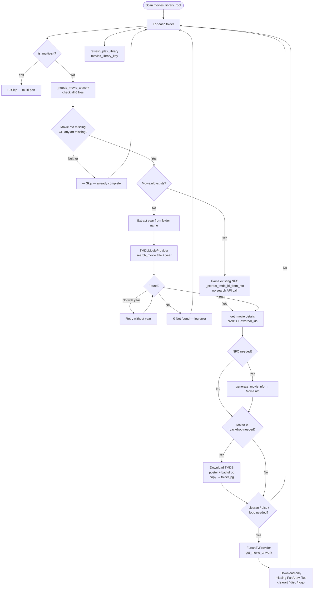

---

## Diagram 20 — Metadata Generator: TV Show Processing Flow

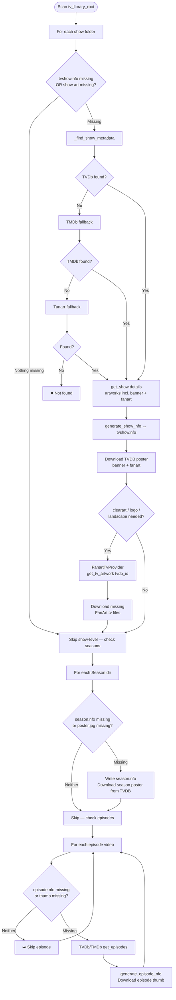

---

## Diagram 21 — Metadata Generator: Music Processing Flow

```mermaid
flowchart TD
  A([Scan music_library_root]) --> B[For each Artist dir]
  B --> C{artist.nfo missing\nor artist.jpg missing?}
  C -- Neither --> D[Skip artist-level — check albums]
  C -- Missing --> E[MusicBrainzProvider.search_artist\nlocal DB or REST]
  E --> F{Found?}
  F -- No --> G[Apple MusicKit\nif configured]
  G --> GA{Found?}
  GA -- No --> GB[iTunes search_artist]
  GA -- Yes --> J
  GB --> H{Found?}
  H -- No --> I[⚠ No artist metadata]
  F -- Yes --> J[generate_artist_nfo\nDownload artist.jpg]
  H -- Yes --> J
  J --> D
  D --> K[For each Album dir]
  K --> L{album.nfo missing\nor cover.jpg missing?}
  L -- Neither --> M[Skip album-level — check tracks]
  L -- Missing --> N[Apple MusicKit\nif configured]
  N --> O{Found?}
  O -- No --> P[iTunes search_album\n3000×3000 cover art]
  O -- Yes --> Q[generate_album_nfo\nDownload cover.jpg]
  P --> Q
  Q --> M
  M --> R[For each audio track]
  R --> S{track.nfo missing?}
  S -- No --> T[⏭ Skip track]
  S -- Yes --> U[generate_track_nfo\nMBID + ISRC from album]
  U & T --> R
```

---

## Diagram 22 — Metadata Generator: --media-type Decision Flow

```mermaid
flowchart TD
  A([Script launched]) --> B[Parse --media-type]
  B --> C{Value?}
  C -- tv --> D[process_tv_library\nTVDB + TMDB + FanArt.tv + Tunarr]
  C -- movies --> E[process_movie_library\nTMDB + FanArt.tv]
  C -- music --> F[process_music_library\niTunes + Apple MusicKit + MusicBrainz\nextended script only]
  C -- all --> G[Run all applicable\nbased on config keys present]
  G --> D & E & H{Extended\nscript?}
  H -- Yes --> F
  H -- No --> I[Skip music]
  D --> J[refresh_plex tv_library_key]
  E --> K[refresh_plex movies_library_key]
  F --> L[refresh_plex music_library_key]
```

---

## Diagram 23 — Metadata Generator: Scheduling Architecture

```mermaid
flowchart TD
  A([Daily trigger]) --> B{Platform?}
  B -- macOS --> C[LaunchAgent\ncom.plexmetadata.generator.plist\ninstall-macos.sh]
  B -- Linux --> D[systemd timer\nplex-metadata-generator.timer\ninstall-linux.sh]
  B -- Windows --> E[Task Scheduler XML\nplex-metadata-generator-windows.xml\ninstall-windows.ps1]
  B -- Any --> F[Cron\nplex-metadata-generator-cron]
  B -- Docker --> G[docker-compose.yml\nCronJob in container]
  C & D & E & F & G --> H[plex_metadata_generator.py\n--media-type all]
  H --> I{Selective check\nper item}
  I -- NFO + all art present --> J[⏭ Skip — zero API calls]
  I -- Missing NFO or art --> K[Fetch only what is needed\nWrite NFO + download art]
  K --> L[Plex API refresh]
```

---

## Diagram 24 — Extended Script: Complete System Architecture

```mermaid
flowchart TD
  subgraph Input["Library Roots (config or first-run dialog)"]
    MOV_ROOT[movies_library_roots]
    TV_ROOT[tv_library_roots]
    MUS_ROOT[music_library_roots]
  end

  subgraph MovieAPIs["Movie APIs"]
    TMDB[TMDB v3\nMovie metadata\nposter + backdrop]
    FANART_MOV[FanArt.tv v3\nclearart · disc · logo]
  end

  subgraph TVAPIS["TV APIs"]
    TVDB[TheTVDB v4\nShow + episode metadata\nseason/episode artwork]
    TMDB_TV[TMDB v3\nTV fallback]
    TUNARR[Tunarr SQLite\nChannel metadata fallback]
    FANART_TV[FanArt.tv v3\nclearart · logo · landscape]
  end

  subgraph MusicAPIs["Music APIs — priority cascade"]
    MB_DB[MusicBrainz\nLocal PostgreSQL DB\noptional · instant]
    MB_JSON[MusicBrainz\nJSON Dump\noptional · no DB needed]
    MUSICKIT[Apple MusicKit\noptional · $99/yr]
    ITUNES[iTunes Search API\nalways active · free]
    MB_REST[MusicBrainz REST\nrate-limited fallback]
  end

  subgraph SubAPIs["Subtitle APIs"]
    OPENSUB[OpenSubtitles\nprimary · 5-40/day]
    SUBDL[Subdl\nautomatic fallback]
  end

  subgraph Processing["Extended Script Processing"]
    MOV_PROC[process_movie_library\nTMDB + FanArt.tv]
    TV_PROC[process_tv_library\nTVDB + TMDB + FanArt.tv + Tunarr]
    MUS_PROC[process_music_library\nMusic provider cascade]
    SUB_PROC[SubtitleDownloader\nper video file]
  end

  subgraph Output["Written to disk"]
    NFO[NFO files\nMovie.nfo · tvshow.nfo\nalbum.nfo · artist.nfo\ntrack.nfo · episode.nfo]
    ART[Artwork\nposter · backdrop · folder\nclearart · disc · logo\nbanner · fanart · landscape\ncover · artist.jpg]
    SUBS[Subtitles\nstem.lang.srt sidecar\nmov_text embedded track]
  end

  MOV_ROOT --> MOV_PROC
  TV_ROOT  --> TV_PROC
  MUS_ROOT --> MUS_PROC

  TMDB --> MOV_PROC
  FANART_MOV --> MOV_PROC
  TVDB & TMDB_TV & TUNARR --> TV_PROC
  FANART_TV --> TV_PROC
  MB_DB & MB_JSON & MUSICKIT & ITUNES & MB_REST --> MUS_PROC

  MOV_PROC & TV_PROC --> SUB_PROC
  OPENSUB & SUBDL --> SUB_PROC

  MOV_PROC --> NFO & ART
  TV_PROC  --> NFO & ART
  MUS_PROC --> NFO & ART
  SUB_PROC --> SUBS

  NFO & ART & SUBS --> PLEX[Plex Local Media Assets\nauto-refresh after run]
```

---

## Diagram 25 — Extended Script: First-Run Setup Dialog Flow

```mermaid
flowchart TD
  A([Script launched\nconfig missing or incomplete]) --> B[Check movies_library_roots]
  B --> C{Present?}
  C -- No --> D[Dialog: Do you have a Movies library?]
  D -- Yes --> E[macOS: Finder folder picker\nLinux/Win: terminal input]
  E --> F[Dialog: Add another Movies volume?]
  F -- Yes --> E
  F -- No --> G[Write movies_library_roots to config]
  D -- No --> G
  C -- Yes --> G
  G --> H[Same flow for TV library]
  H --> I[Same flow for Music library]
  I --> J[Check TMDB key]
  J --> K{Set and valid?}
  K -- No --> L[Dialog: Enter TMDB API key\nhttps://themoviedb.org/settings/api]
  L --> M[Validate: GET /configuration]
  M --> N{Valid?}
  N -- No --> O[Show error: invalid key\nRetry?]
  O -- Yes --> L
  O -- No --> P[Skip — movies unavailable this run]
  N -- Yes --> Q[Write tmdb.api_key to config]
  K -- Yes --> Q
  Q --> R[Same flow for TVDB key]
  R --> S[FanArt.tv key: optional\nShow Skip button]
  S --> T[OpenSubtitles key: optional\nShow Skip button]
  T --> U[Apple MusicKit: optional\nShow Skip button]
  U --> V[Dialog: Force full rescan?\nYes = --force / No = selective]
  V --> W[Dialog: Save all settings to config?]
  W -- Yes --> X[Write config file]
  W -- No --> X2[Use in-memory for this run only]
  X & X2 --> Y([Begin processing])
```

---

## Diagram 26 — API Key Validation + 15-Day Revalidation Flow

```mermaid
flowchart TD
  A([Script startup]) --> B[Load config]
  B --> C[Check key_validation_state.json\nin cache_dir]
  C --> D{Cache exists?}
  D -- No --> E[Run full validation\nall configured keys]
  D -- Yes --> F{Any key last_validated\n> 15 days ago?}
  F -- No --> G[All keys valid — skip validation\nProceed to processing]
  F -- Yes --> H[Re-validate expired keys only]
  E & H --> I[For each key to validate]
  I --> J{Service?}
  J -- TMDB --> K[GET /configuration → 200?]
  J -- TVDB --> L[POST /v4/login → token?]
  J -- FanArt.tv --> M[GET /movies/0 → 200?]
  J -- OpenSubtitles --> N[GET /infos/user → 200?]
  J -- Apple MusicKit --> O[Sign JWT + test API call]
  K & L & M & N & O --> P{Passed?}
  P -- Yes --> Q[Write last_validated = now\nto key_validation_state.json]
  Q --> R{More keys?}
  R -- Yes --> I
  R -- No --> G
  P -- No --> S{--no-prompts mode?}
  S -- No --> T[Blocking dialog:\nKey for SERVICE has expired\nPlease enter a new key]
  T --> U[User enters new key]
  U --> V[Validate new key]
  V --> W{Valid?}
  W -- Yes --> Q
  W -- No --> X[Show error: still invalid\nRetry or Skip?]
  X -- Retry --> U
  X -- Skip --> Y[Log warning: SERVICE disabled this run\nContinue without it]
  S -- Yes --> Y
  Y --> R
```

---

## Diagram 27 — Subtitle Download + Embedding Flow

```mermaid
flowchart TD
  A([Video file found]) --> B[Read IMDb ID\nfrom Movie.nfo or tvshow.nfo]
  B --> C{sidecar exists?\nstem.lang.srt}
  C -- Yes --> D{embed_in_file enabled?}
  D -- Yes --> E[ffprobe: check for\nexisting subtitle stream]
  E --> F{Embedded sub found\nin correct language?}
  F -- Yes --> G[⏭ Skip — already complete]
  F -- No --> H[Subtitle needed: embed only]
  D -- No --> G
  C -- No --> I[Subtitle needed: download + embed]
  H & I --> J[Try OpenSubtitles]
  J --> K[Search by IMDb ID\n+ language code]
  K --> L{Result found?}
  L -- Yes --> M[POST /download → SRT URL]
  M --> N[Download SRT bytes]
  L -- No --> O[Try Subdl fallback]
  O --> P[Search by IMDb ID]
  P --> Q{Result found?}
  Q -- No --> R[⚠ No subtitle found\nlog warning, continue]
  Q -- Yes --> S[Download ZIP\nextract first .srt]
  N & S --> T{sidecar mode enabled?}
  T -- Yes --> U[Write stem.lang.srt]
  T -- No --> V
  U --> V{embed_in_file enabled?}
  V -- No --> W([Done])
  V -- Yes --> X{Container is MP4/M4V?}
  X -- No --> Y[⚠ embed skipped\nnot MP4/M4V container\nsidecar only]
  X -- Yes --> Z{ffmpeg on PATH?}
  Z -- No --> Y
  Z -- Yes --> AA[ffmpeg: copy streams\n+ add mov_text subtitle track\ntagged with ISO 639-2 lang]
  AA --> BB[Write to temp.mp4]
  BB --> CC{temp size ≥ 95%\nof original?}
  CC -- No --> DD[❌ Sanity check failed\ndelete temp, keep original]
  CC -- Yes --> EE[Replace original\nwith temp.mp4]
  EE --> W
  G --> W
```

---

## Diagram 28 — Music Provider Selection Flow

```mermaid
flowchart TD
  A([Artist or Album lookup needed]) --> B{Local PostgreSQL DB\nconfigured and skip=false?}
  B -- Yes --> C[MusicBrainzLocalProvider\nsearch_artist / get_album]
  C --> D{Found?}
  D -- Yes --> E([Return result])
  D -- No --> F
  B -- No --> F{JSON dump dir\nconfigured?}
  F -- Yes --> G[MusicBrainzJsonProvider\nread MBID JSON files]
  G --> H{Found?}
  H -- Yes --> E
  H -- No --> I
  F -- No --> I{Apple MusicKit\nenabled=true?}
  I -- Yes --> J[Generate ES256 JWT\nfrom .p8 key file]
  J --> K[MusicKit API search\nartist or album]
  K --> L{Found?}
  L -- Yes --> E
  L -- No --> M
  I -- No --> M[iTunes Search API\nalways active · no auth]
  M --> N[GET itunes.apple.com/search\nmedia=music · entity=album]
  N --> O{Found?}
  O -- Yes --> P[Rewrite art URL to 3000x3000\nre.sub 100x100bb → 3000x3000bb]
  P --> E
  O -- No --> Q[MusicBrainz REST API\nrate-limited 1 req/sec]
  Q --> R{Found?}
  R -- Yes --> E
  R -- No --> S[⚠ Log warning\nno metadata for this item]
```

---

## Diagram 29 — iTunes Search API vs Apple MusicKit Decision

```mermaid
flowchart TD
  A([Music library configured]) --> B{apple_musickit.enabled\nin config?}
  B -- No --> C[iTunes Search API only\nfree · zero auth · always active]
  B -- Yes --> D{.p8 key file exists\nat private_key_path?}
  D -- No --> E[⚠ MusicKit enabled but key missing\nFallback to iTunes Search API]
  D -- Yes --> F{cryptography package\ninstalled?}
  F -- No --> G[⚠ pip3 install cryptography needed\nFallback to iTunes Search API]
  F -- Yes --> H[Generate ES256 JWT token\nvalid for 6 months]
  H --> I[MusicKit API active\n+ iTunes as fallback]

  C --> J[Album art: 3000×3000\nURL substitution trick]
  E --> J
  G --> J
  I --> K[Album art: native 3000×3000\nfrom Apple catalog masters]

  J --> L[artist.nfo · album.nfo · track.nfo\nBasic metadata\ntitle · year · genre · label]
  K --> M[artist.nfo · album.nfo · track.nfo\nRich metadata\n+ ISRC · composer · explicit flag]

  L & M --> N([appleid tag written\nto all music NFOs])
```

---

## Diagram 30 — Base Script vs Extended Script: Which to Use

```mermaid
flowchart TD
  A([Do you have a music library\nin Plex?]) --> B{Yes / No}
  B -- No --> C[Use plex_metadata_generator.py\nLighter · no music dependencies]
  B -- Yes --> D[Use plex_metadata_generator_extended.py\nFull music support]

  C --> E{Do you want\nsubtitles?}
  D --> E
  E -- Yes --> F[Enable subtitles block in config\nOpenSubtitles API key recommended]
  E -- No --> G[Leave subtitles.enabled: false]

  D --> H{Large music library\nand slow REST API?}
  H -- Yes --> I{Have PostgreSQL\ninstalled?}
  I -- Yes --> J[Download MusicBrainz\nPostgreSQL dump\n~30 GB · instant lookups]
  I -- No --> K[Download MusicBrainz\nJSON dump\n~80 GB · no DB needed]
  H -- No --> L[MusicBrainz REST API\nworks fine for small libraries]

  D --> M{Have Apple Developer\naccount 99/yr?}
  M -- Yes --> N[Configure Apple MusicKit\nfor richer metadata + ISRC]
  M -- No --> O[iTunes Search API is sufficient\nfree · 3000x3000 art · works now]
```

---

## Diagram 31 — Extended Script: Complete Run Sequence

```mermaid
sequenceDiagram
  participant CLI as CLI / Scheduler
  participant Script as Extended Script
  participant Dialog as Setup Dialogs
  participant Val as Key Validator
  participant Movie as Movie Processor
  participant TV as TV Processor
  participant Music as Music Processor
  participant Sub as Subtitle Downloader
  participant Plex as Plex API

  CLI->>Script: python3 plex_metadata_generator_extended.py --media-type all

  Script->>Dialog: Check config completeness
  Dialog-->>Script: Paths + keys confirmed (or dialogs shown)

  Script->>Val: Check key_validation_state.json
  Val-->>Script: All valid (or blocking dialog for expired key)

  Script->>Movie: process_movie_library(workers=N)
  loop Each movie folder (parallel if workers>1)
    Movie->>Movie: _needs_nfo() + _missing_art()
    alt Already complete
      Movie->>Movie: ⏭ Skip — zero API calls
    else NFO or art missing
      Movie->>Movie: TMDb search → get details
      Movie->>Movie: Write Movie.nfo
      Movie->>Movie: Download poster/backdrop (TMDB)
      Movie->>Movie: Download clearart/disc/logo (FanArt.tv)
    end
  end

  Script->>TV: process_tv_library(workers=N)
  loop Each show folder (parallel if workers>1)
    TV->>TV: Check tvshow.nfo + show art
    alt Already complete
      TV->>TV: ⏭ Skip show-level
    else Missing
      TV->>TV: TVDb search → get details
      TV->>TV: Write tvshow.nfo + download show art
    end
    loop Each episode
      TV->>TV: Check episode.nfo + thumb
      alt Already complete
        TV->>TV: ⏭ Skip episode
      else Missing
        TV->>TV: Write episode.nfo + download thumb
      end
    end
  end

  Script->>Music: process_music_library(workers=N)
  loop Each artist (parallel if workers>1)
    Music->>Music: Try MB_DB → JSON → MusicKit → iTunes → MB_REST
    Music->>Music: Write artist.nfo + artist.jpg
    loop Each album
      Music->>Music: Write album.nfo + cover.jpg
      loop Each track
        Music->>Music: Write track.nfo
      end
    end
  end

  Script->>Sub: SubtitleDownloader (if enabled)
  loop Each video file
    Sub->>Sub: Check sidecar + embedded sub
    alt Already complete
      Sub->>Sub: ⏭ Skip
    else Missing
      Sub->>Sub: OpenSubtitles search by IMDb ID
      Sub->>Sub: Download .srt → write sidecar
      Sub->>Sub: ffmpeg embed mov_text track
    end
  end

  Script->>Plex: refresh_library(movies_key)
  Script->>Plex: refresh_library(tv_key)
  Script->>Plex: refresh_library(music_key)
  Plex-->>Script: 200 OK
  Script->>CLI: ✓ Done (N processed · M skipped · K errors)
