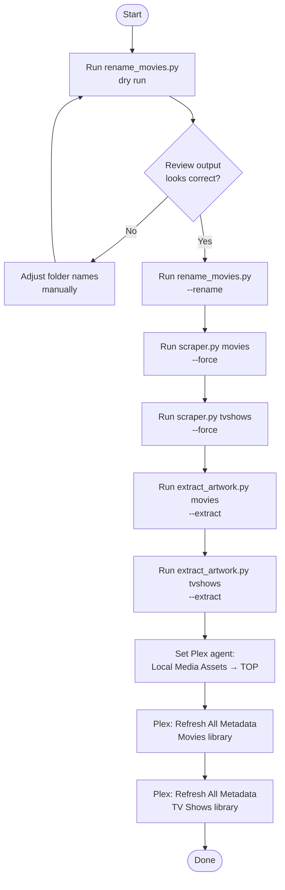
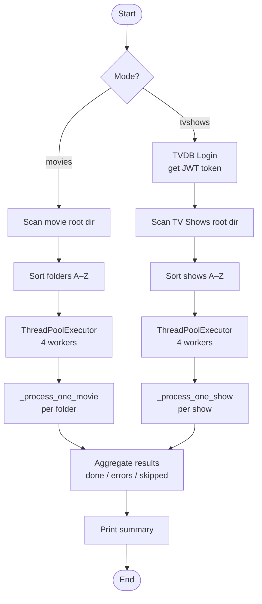
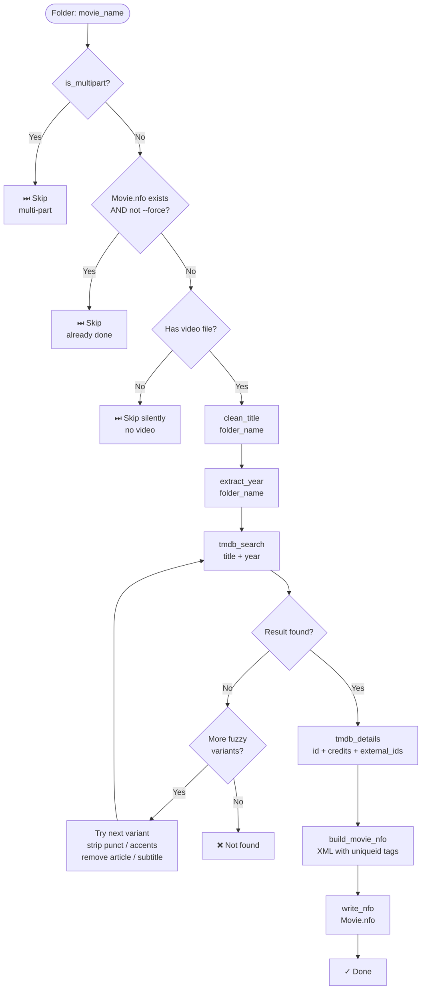
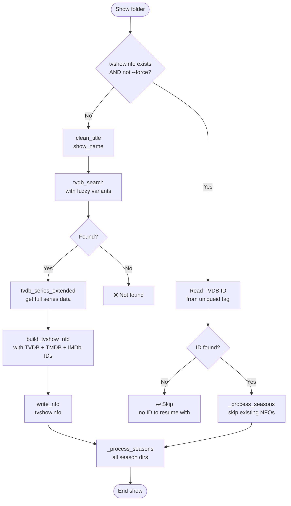
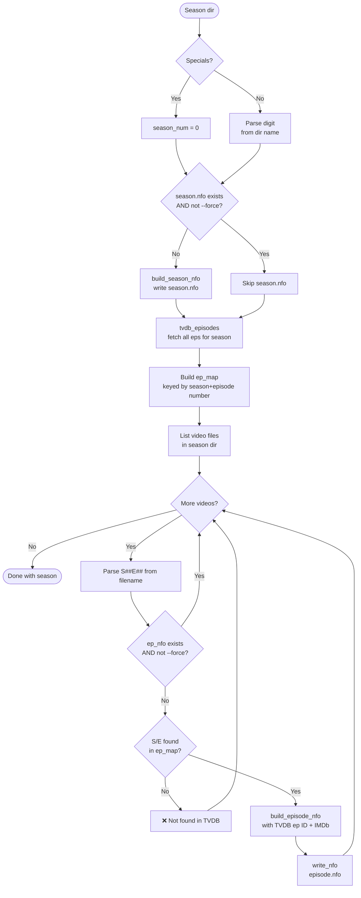
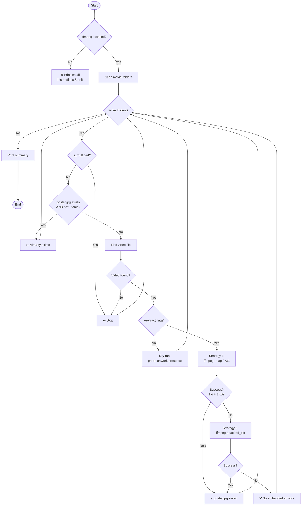
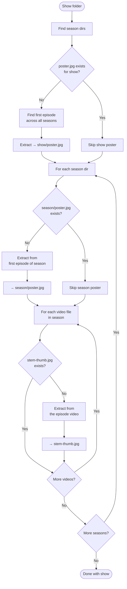
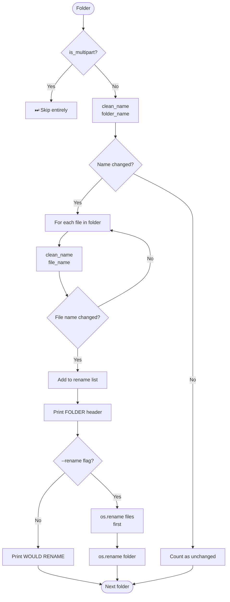
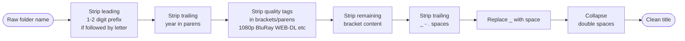

# Process Flow Diagrams

All diagrams are in [Mermaid](https://mermaid.js.org/) format and render natively on GitHub.

---

## 1. Overall Pipeline — End to End

---

## 2. scraper.py — Top-Level Flow

---

## 3. scraper.py — Movie Processing (per folder)

---

## 4. scraper.py — TV Show Processing (per show)

---

## 5. scraper.py — Season & Episode Processing

---

## 6. scraper.py — Fuzzy Title Matching

---

## 7. extract_artwork.py — Movie Mode Flow

---

## 8. extract_artwork.py — TV Show Mode Flow

---

## 9. rename_movies.py — Decision Flow

---

## 10. clean_title() — Transformation Pipeline

---

## 11. Plex Configuration After Running Scripts

